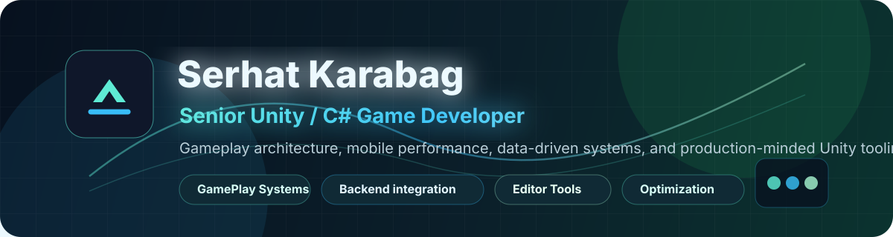

  

  
  

## About

I am a senior Unity/C# game developer focused on gameplay systems, scalable project architecture, mobile performance, and tooling that keeps production workflows clear. I like building systems that are easy to tune, test, extend, and reason about under real gameplay pressure.

- Gameplay architecture with state machines, dependency injection, data-driven configuration, and clean runtime boundaries
- Mobile-first Unity development with responsive UI, Android builds, memory-aware systems, and performance-minded code
- Puzzle, arcade, card, and hyper-casual gameplay prototypes with production-style structure
- Unity editor tooling, ScriptableObject workflows, backend-connected clients, and server-authoritative gameplay flows

## Core Stack

  
  
  
  
  
  
  
  
  
  
  
  

## Featured Work

| Project | Focus | Highlights |
| --- | --- | --- |
| [unity-plinko-server-authoritative](https://github.com/SerhatKarabag/unity-plinko-server-authoritative) | Server-authoritative arcade flow | Deterministic trajectory simulation, mock backend, reward batching, anti-cheat validation, persistence |
| [unity-memory-match](https://github.com/SerhatKarabag/unity-memory-match) | Production-style puzzle game | Clean C# architecture, dependency injection, persistence, responsive UI, procedural audio, EditMode tests |
| [unity-top-down-shooter-prototype](https://github.com/SerhatKarabag/unity-top-down-shooter-prototype) | Shooter gameplay systems | ScriptableObject power-ups, Zenject composition, pooled projectiles, decorator/builder/factory patterns |
| [unity-match-3d-puzzle](https://github.com/SerhatKarabag/unity-match-3d-puzzle) | Mobile-style Match 3D puzzle | ScriptableObject levels, booster mechanics, DOTween animations, custom level editor |
| [unity-pisti-card-game](https://github.com/SerhatKarabag/unity-pisti-card-game) | Card game logic | AI opponents, scoring flow, Unity card gameplay structure, positively evaluated FUGO Games assessment |
| [unity-sled-surfers-clone](https://github.com/SerhatKarabag/unity-sled-surfers-clone) | 3D arcade runner clone | Slingshot launch, downhill steering, collectibles, upgrades, Android build, positively evaluated CrayzLabs assessment |
| [cozmopol-product-catalog](https://github.com/SerhatKarabag/cozmopol-product-catalog) | Unity client + local API | Product browsing, filtering, update flow, Express/PostgreSQL backend, Docker setup |

## Engineering Focus

- Clear gameplay boundaries over monolithic scene scripts
- Data-driven tuning through ScriptableObjects, config assets, and editor tools
- Allocation-aware systems for mobile gameplay loops
- Deterministic or validated flows for rewards, scoring, and server-facing logic
- Readable C# that can survive iteration, debugging, and future feature work

## GitHub Snapshot

  
  

## Current Direction

I am continuing to sharpen my portfolio around senior Unity work: architecture-heavy gameplay samples, polished mobile prototypes, backend-connected game flows, and practical editor tooling.
